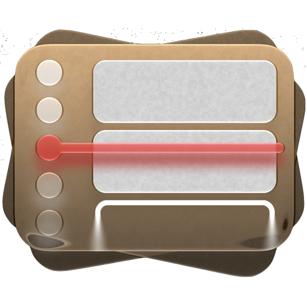

# Timetable website

Timetable website built with TanStack Start, Vite, React, Nitro, and Bun.

This is effectively a web port of the existing SwiftUI app.

It is also designed to look like the existing SwiftUI app, for example my recreating of the liquid glass toolbars and sidebars

## Development

```bash
bun install
bun run dev
```

Type-check and test with `bun run typecheck` and `bun test`.

## Production

```bash
bun run build
bun run start
```

The production build is emitted to `.output/server/index.mjs` by Nitro's Bun preset.
