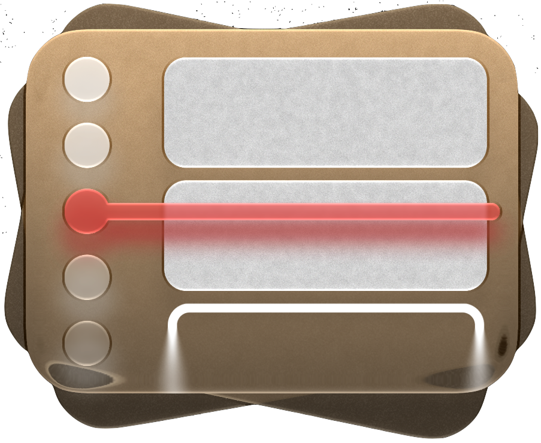

# Timetable website

Timetable website built with Next.js, React, and Bun.

This is effectively a web port of the existing SwiftUI app.

It is also designed to look like the existing SwiftUI app, for example my recreating of the liquid glass toolbars and sidebars

## Development

```bash
bun install
bun run dev
```

## Production

```bash
bun run build
bun run start,
```
